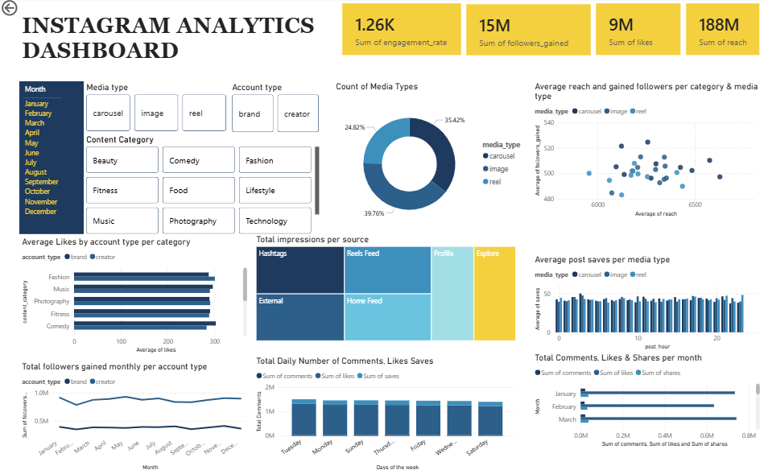

# DSA 3050A - Instagram Analytics Dashboard

## Assignment 2: Introduction to Power BI Dashboards

**Author:** Jessica Kimani

---

## Project Overview

This project analyzes Instagram performance data using Microsoft Power BI. The dashboard provides insights into audience engagement, content performance, follower growth, reach, impressions, and traffic sources. Interactive filters allow users to explore performance trends across different months, media types, account types, and content categories.

The objective of the dashboard is to support data-driven decision-making by identifying the factors that contribute most to Instagram growth and engagement.

## Dashboard Preview

## Key Insights

1. **Total Reach:** **188 Million**
2. **Total Likes:** **9 Million**
3. **Total Followers Gained:** **15 Million**
4. **Average Engagement Rate:** **1.26K**
5. **Reels generated the highest reach and follower growth compared to images and carousels.**
6. **Fashion, Technology, and Beauty content categories recorded the highest average likes.**
7. **Explore and Reels Feed were the leading traffic sources for impressions.**
8. **Audience engagement was highest during mid-week posting periods.**

## Dashboard Features

* KPI Cards displaying:
  * Engagement Rate
  * Followers Gained
  * Likes
  * Reach

* Interactive Filters:
  * Month
  * Media Type
  * Account Type
  * Content Category

* Visualizations:
  * Donut Chart (Media Type Distribution)
  * Scatter Plot (Reach vs Followers Gained)
  * Bar Chart (Average Likes by Category)
  * Treemap (Impressions by Traffic Source)
  * Column Chart (Average Saves by Posting Hour)
  * Line Chart (Monthly Followers Gained)
  * Daily Engagement Analysis
  * Monthly Engagement Analysis

## Business Questions Answered

* Which media type performs best on Instagram?
* Which content categories receive the highest engagement?
* Which traffic sources generate the most impressions?
* How does reach influence follower growth?
* What are the best posting hours for maximizing saves?
* How does engagement vary across days and months?
* How do Brand and Creator accounts compare in performance?

## Files Included

* `Instagram Analytics Dashboard.pbix` → Power BI report file
* `BISSDashboard.png` → Dashboard screenshot
* `Instagram_Analytics.csv` → Dataset used for analysis
* `Jessica DSA3050_Lab2_Instagram_Report` → Dashboard report documentation

## Dataset Information

* Source: Kaggle
* Dataset: Instagram Analytics Dataset
* Records: 29,999
* Variables: 23
* Format: CSV
* Time Period: November 2024 – November 2025

## Tools Used

* Microsoft Power BI Desktop
* Microsoft Excel / CSV Dataset
* Kaggle Dataset Repository

The dashboard demonstrates how Business Intelligence tools can transform social media data into actionable insights. Through interactive visualizations and performance metrics, users can identify effective content strategies, optimize posting schedules, and improve audience growth on Instagram.
